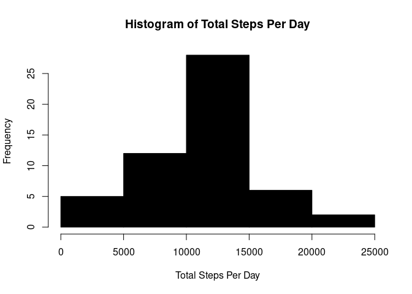
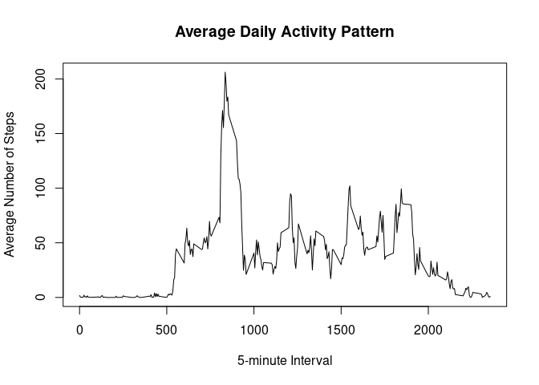
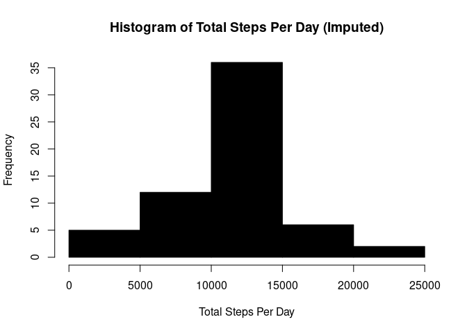
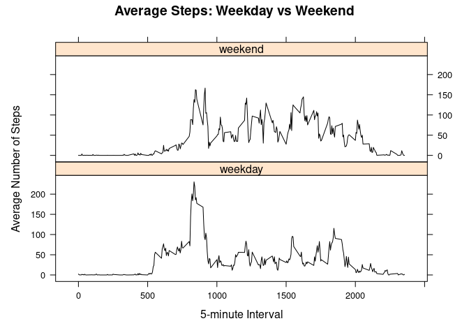

## Loading and preprocessing the data

``` r
activity_data <- read.csv("activity.csv")

activity_data$date <- as.Date(activity_data$date)
head(activity_data)
```

```
##   steps       date interval
## 1    NA 2012-10-01        0
## 2    NA 2012-10-01        5
## 3    NA 2012-10-01       10
## 4    NA 2012-10-01       15
## 5    NA 2012-10-01       20
## 6    NA 2012-10-01       25
```

## What is mean total number of steps taken per day?

``` r
total_steps_per_day <- aggregate(steps ~ date, data = activity_data, sum, na.rm = TRUE)

hist(total_steps_per_day$steps, main = "Histogram of Total Steps Per Day", 
     xlab = "Total Steps Per Day", col = "black")
```

<!-- -->
Calculate mean and median

``` r
mean_steps <- mean(total_steps_per_day$steps)
median_steps <- median(total_steps_per_day$steps)
mean_steps
```

```
## [1] 10766.19
```

``` r
median_steps
```

```
## [1] 10765
```


## What is the average daily activity pattern?

``` r
avg_steps_interval <- aggregate(steps ~ interval, data = activity_data, mean, na.rm = TRUE)

plot(avg_steps_interval$interval, avg_steps_interval$steps, type = "l", col = "black",
     xlab = "5-minute Interval", ylab = "Average Number of Steps",
     main = "Average Daily Activity Pattern")
```

<!-- -->

``` r
max_interval <- avg_steps_interval[which.max(avg_steps_interval$steps), ]
max_interval
```

```
##     interval    steps
## 104      835 206.1698
```


## Imputing missing values

``` r
missing_values <- sum(is.na(activity_data$steps))
missing_values
```

```
## [1] 2304
```
Impute missing values with the mean for the corresponding 5-minute interval and generate a histogram 
of total steps per day with imputed values

``` r
activity_data_imputed <- activity_data
activity_data_imputed$steps[is.na(activity_data_imputed$steps)] <- 
  avg_steps_interval$steps[match(activity_data_imputed$interval, avg_steps_interval$interval)]
```

```
## Warning in activity_data_imputed$steps[is.na(activity_data_imputed$steps)] <-
## avg_steps_interval$steps[match(activity_data_imputed$interval, : number of
## items to replace is not a multiple of replacement length
```

``` r
total_steps_imputed <- aggregate(steps ~ date, data = activity_data_imputed, sum)
hist(total_steps_imputed$steps, main = "Histogram of Total Steps Per Day (Imputed)", 
     xlab = "Total Steps Per Day", col = "black")
```

<!-- -->

``` r
mean_steps_imputed <- mean(total_steps_imputed$steps)
median_steps_imputed <- median(total_steps_imputed$steps)
mean_steps_imputed
```

```
## [1] 10766.19
```

``` r
median_steps_imputed
```

```
## [1] 10766.19
```


## Are there differences in activity patterns between weekdays and weekends?

``` r
activity_data_imputed$day_type <- ifelse(weekdays(activity_data_imputed$date) %in% 
                                         c("Saturday", "Sunday"), "weekend", "weekday")

avg_steps_day_type <- aggregate(steps ~ interval + day_type, data = activity_data_imputed, mean)


library(lattice)
xyplot(steps ~ interval | day_type, data = avg_steps_day_type, type = "l", layout = c(1, 2),
       xlab = "5-minute Interval", ylab = "Average Number of Steps",col = "black",
       main = "Average Steps: Weekday vs Weekend")
```

<!-- -->
